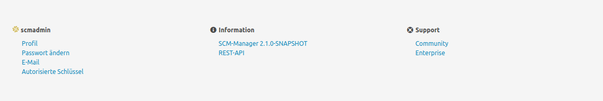
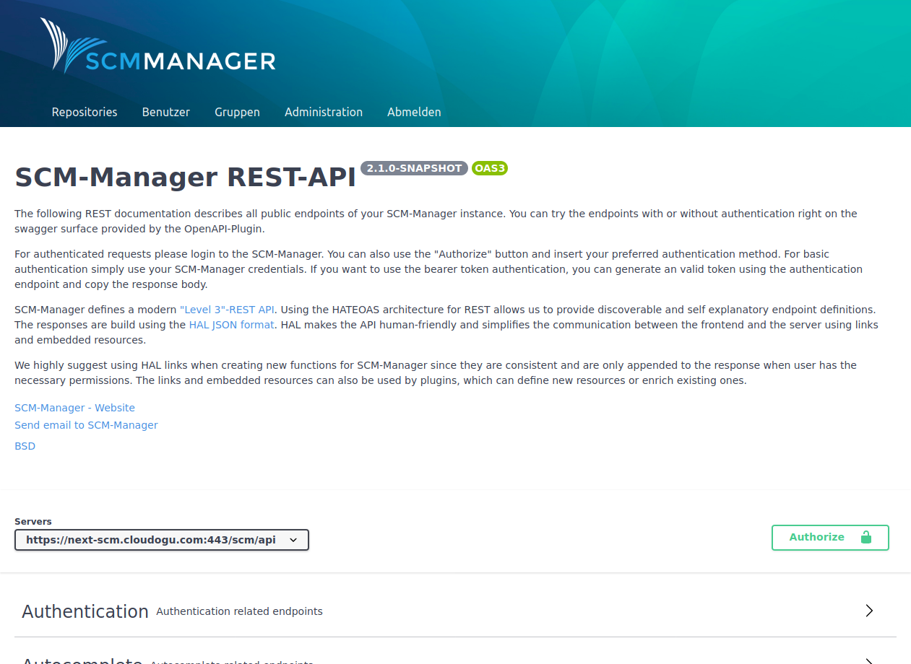
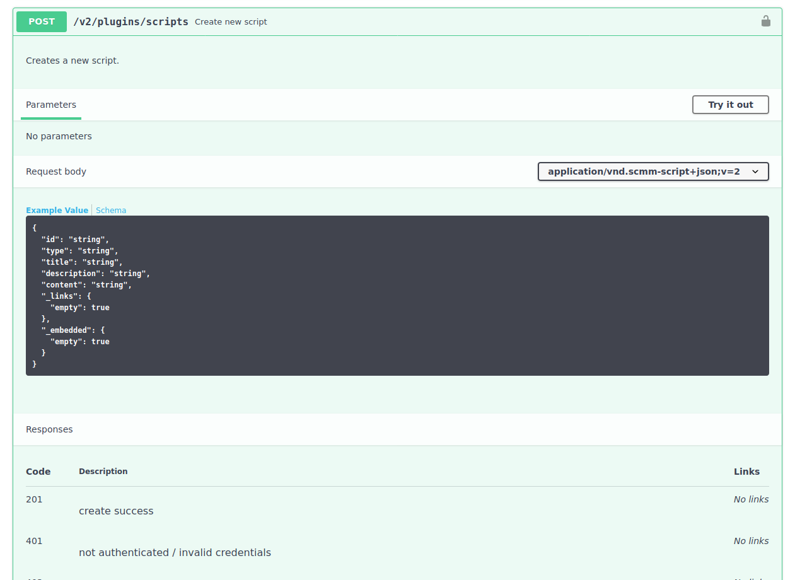
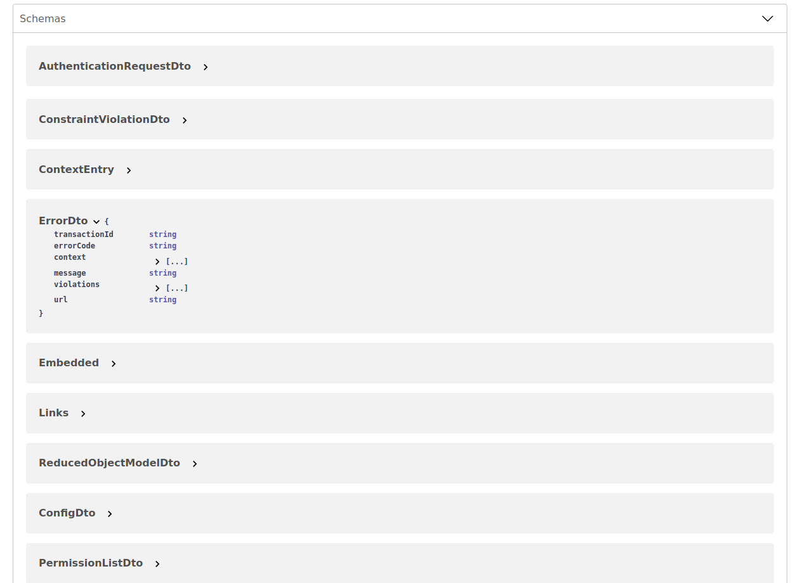

Sobald das OpenAPI-Plugin installiert ist, findet sich in der Fußleiste des SCM-Managers ein Link zur SwaggerUI (REST-API).

### Beschreibung

Die Swagger-Seite ist in mehrere Sektionen aufgeteilt. Im oberen Abschnitt befindet sich eine kurze Beschreibung zur Version und zum Umgang mit der REST-API.

### Verbindung + Authentifizierung

Unter der Beschreibung ist ersichtlich, gegen welchen Server die Endpunkte gerichtet sind. Für eine autorisierte Verbindung gibt es die Möglichkeit über den "Authorize"-Button die Zugangsdaten eines SCM-Manager Benutzers zu hinterlegen. Alternativ kann ein API-Schlüssel verwendet werden, der bei Bedarf vorher generiert werden kann (siehe Beschreibung).

### Endpunkte

Es folgt der umfassendste Bereich mit den Beschreibungen aller verfügbaren REST-Endpunkte. 

Jeder Endpunkt beschreibt seine Funktion, die Endpunkt-Adresse, die erwarteten Daten, die zurückgelieferten Daten und alle möglichen Statuscodes. Die Endpunkte können über die Oberfläche direkt ausgeführt werden. Bei den meisten Endpunkten wird eine vorherige Authentifizierung vorausgesetzt, da diese nur mit der nötigen Berechtigung verwendet werden dürfen. Andernfalls kommt eine Antwort mit einem Fehlercode zurück.

### Schemas

Im untersten Bereich werden die verwendeten Schemas für die Anfragen und Antworten aufgeführt. Die einzelnen Schemata werden auch beim verwendeten Endpunkt aufgeführt.

### Nutzung in Skripten (HAL)

Der SCM-Manager setzt mit seiner REST Schnittstelle die sogenannte _Hypertext Application Language_ ([HAL](https://en.wikipedia.org/wiki/Hypertext_Application_Language)) um. Dieses bedeutet, dass in automatisierten Skripten bzw. Programmen nicht direkt die Links genutzt werden sollen, sondern dass sich ein Programm durch die API "navigieren" kann.

Bei einer Automatisierung sollte immer als Einstieg der **Index** genutzt werden. Dieser liefert neben der Information zu der Version des SCM-Managers eine Liste mit weiteren verfügbaren Links. Hier befindet sich z.B. der Link `repositories`, mit dem die vorhandenen Repositories geladen werden können (wenn die entsprechende Berechtigung vorhanden ist). Wird wiederum dieser Endpunkt ausgeführt, so enthält die Liste der Repositories mit ihren eigenen Links auch weitere Links, z.B. `create`, um ein neues Repository zu erzeugen.

Die Nutzung dieser Links hat die folgenden Vorteile:

1. Bei einer Änderung der URLs bleibt das Skript stabil, da die Navigation sich nicht ändert.
2. Durch das Nutzen der Links kann geprüft werden, ob die entsprechende Berechtigung vorliegt (Links, die mit den aktuellen Berechtigungen nicht aufgerufen werden können, werden nicht ausgegeben).
3. Ein installiertes Plugin spiegelt sich in den Links wider. So kann ein Skript entsprechend der Konfiguration der Instanz reagieren.
