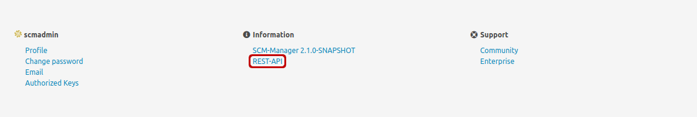
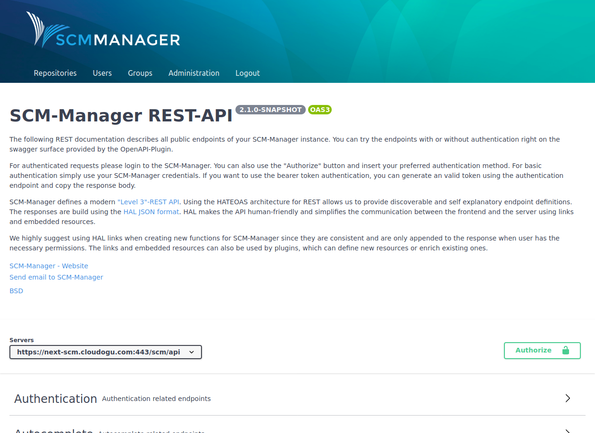
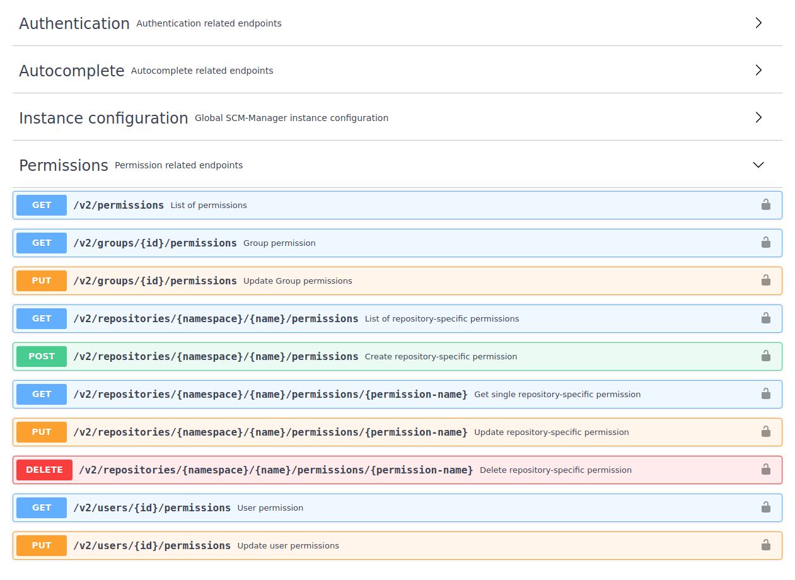
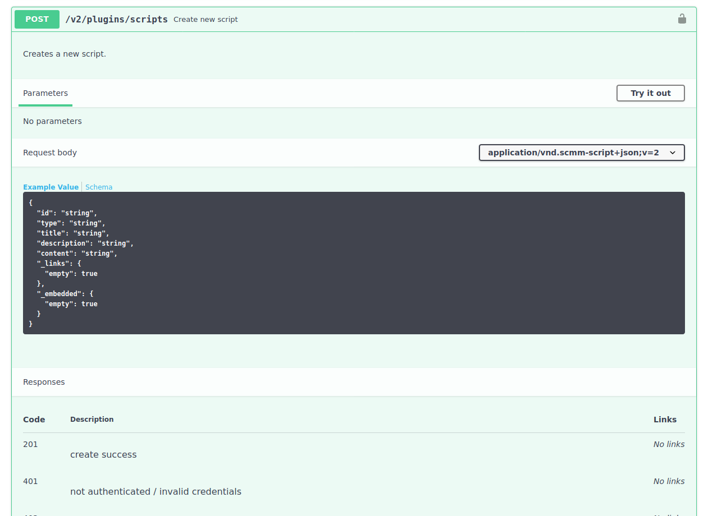
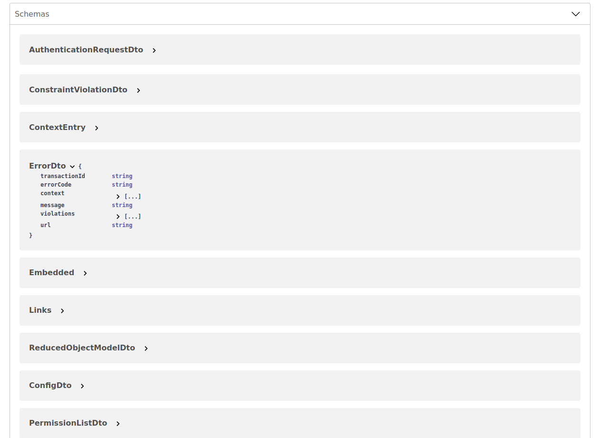

As soon as the OpenApi plugin is installed, the footer of SCM-Manager contains a link to the SwaggerUI (REST API).

### Description

The Swagger page is divided into several sections. The top part contains a short description about the version and how to use the REST API.

### Connection + authentication

Below the description it is displayed against which servers the endpoints are directed. For an authorized connection it is possible to use a SCM-Manager user`s credentials with the "Authorize" button. Alternatively, a previously generated API key can be used (see description).

### Endpoints

What follows is the most comprehensive section, the description of the available REST endpoints.

Each endpoint describes its function, the address of the endpoint, the expected data, the replied data and all possible status codes. The endpoints can be tried out directly via the UI. Most endpoints require an authentication, because they can only be used with the necessary permission. Otherwise it will return a reply with an error code.

### Schemas

The section at the bottom shows the schemas that are used for requests and replies. The schemes are also executed at the used endpoint.

### Use in scripts (HAL)

SCM-Manager uses its REST interface to implement the so-called _Hypertext Application Language_ ([HAL](https://en.wikipedia.org/wiki/Hypertext_Application_Language)). That means that automated scripts resp. applications are not supposed to use direct links, they are supposed to “navigate” through the API.

The entry point of an automation should always be the **Index**, which provides the version of SCM-Manger alongside a list of available links. For example, it contains the link `repositories`, which can be used to load the available repositories (if the required permission is available). If this endpoint is executed, the list contains the repositories with their own links and additional links like for example `create`, to create a new repository.

The usage of these links has these advantages:

1. If URLs change, scripts stay sable, because the navigation is still the same.
2. By using the links it can be ensured that the necessary permissions are available (links that require permissions that are not available, are not provided).
3. An installed plugin is reflected in the list of links. This way scripts can react correspondingly on the configuration of the instance.
